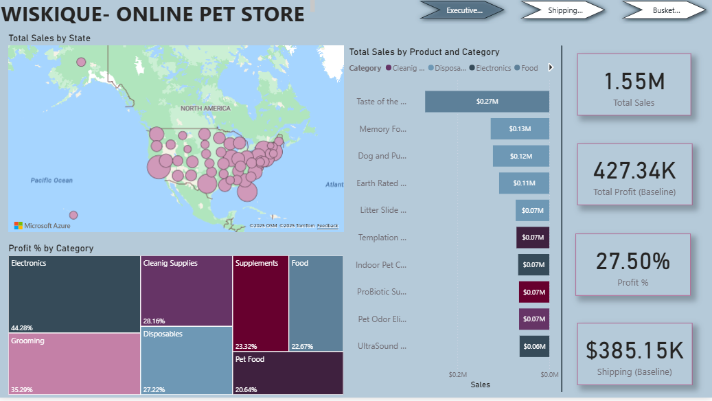
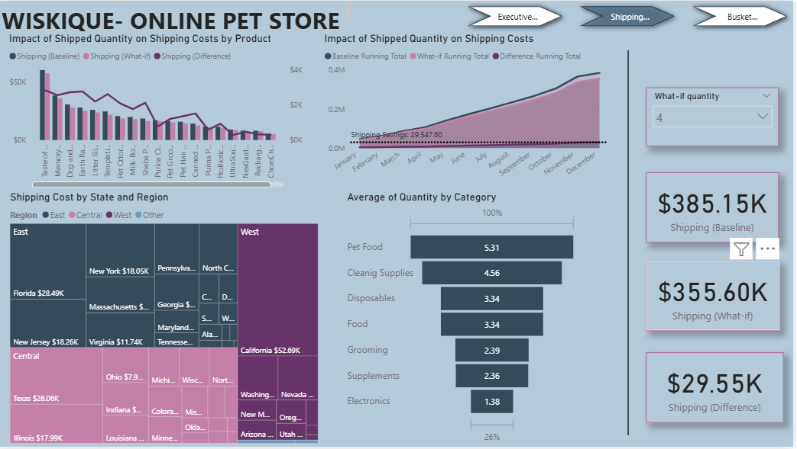
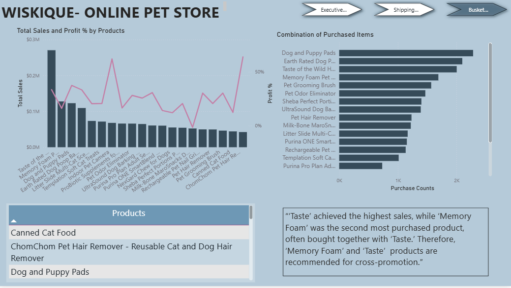

# WISKIQUE – Online Pet Store Sales & Shipping Analytics (Power BI)

## 📊 Project Overview
This project delivers an end-to-end **sales, profit, shipping, and basket analytics dashboard** for an online pet store using **Power BI**.  
The goal is to help business stakeholders understand **product performance, shipping cost efficiency, cross-sell opportunities, and regional demand** to support data-driven operational and marketing decisions.

---

## 🛠 Tools & Technologies
- **Power BI**
- **Power Query**
- **DAX**
- **Excel**

---

## 🧠 Skills Demonstrated
- Data modeling (star schema)
- Data cleaning & transformation
- KPI development and What-If analysis
- Basket (market-basket) analysis
- Shipping cost optimization
- Regional and state-level analysis
- Interactive dashboard design

---

## 📈 Key KPIs
- **Total Sales:** $1.55M  
- **Total Profit:** $427K  
- **Profit Margin:** 27.5%  
- **Shipping Cost (Baseline):** $385K  
- **Potential Shipping Savings:** ~$29.5K (What-If scenario)

---

## 🏗 Data Model
- Designed a **star-schema model** with:
  - **Fact table:** Sales & shipping transactions
  - **Dimension tables:** Products, Categories, Geography, Date
- Improved performance, clarity, and DAX calculation accuracy.

---

## 🔄 Data Preparation
- Cleaned and transformed raw transactional data using **Power Query**
- Key steps:
  - Standardized product and category fields
  - Validated quantities and prices
  - Prepared shipping metrics for scenario analysis
  - Created measures for sales, profit, and shipping KPIs

---

## 📊 Dashboard Pages & Insights

### 1️⃣ Executive Summary
- Overall view of **sales, profit, margin, and shipping costs**
- Product and category-level performance
- Geographic distribution of sales by state

---

### 2️⃣ Shipping & Cost Efficiency
- Analyzed **impact of shipped quantity on shipping costs**
- Built **What-If scenarios** to simulate changes in shipment volume
- Identified **~$29K potential shipping cost savings**

---

### 3️⃣ Basket & Cross-Sell Analysis
- Identified **frequently purchased product combinations**
- Found that products like **“Taste” and “Memory Foam”** are often bought together
- Recommended these products for **cross-promotion and bundling**

---

## 💡 Key Insights
- Shipping costs increase non-linearly with shipped quantity, highlighting optimization opportunities
- Certain products consistently drive both **high sales and strong cross-sell potential**
- Regional shipping analysis reveals cost concentration by state, supporting logistics planning
- Basket analysis enables targeted **cross-sell and promotional strategies**

---

## 📦 Business Impact
This dashboard enables businesses to:
- Reduce shipping costs through scenario-based planning
- Improve product bundling and cross-sell strategies
- Optimize logistics and regional operations
- Gain a unified view of sales, profit, and shipping performance

---

## 📁 How to Use
1. Download the Power BI file
2. Open it in **Power BI Desktop**
3. Adjust **What-If parameters** to simulate shipping scenarios
4. Use filters to explore product, category, and regional insights

---

## 🔗 Portfolio Note
This project is designed as a **portfolio-ready Power BI case study**, demonstrating **advanced analytics**, **What-If modeling**, and **business-focused insights** suitable for **Data Analyst / BI Analyst** roles.
